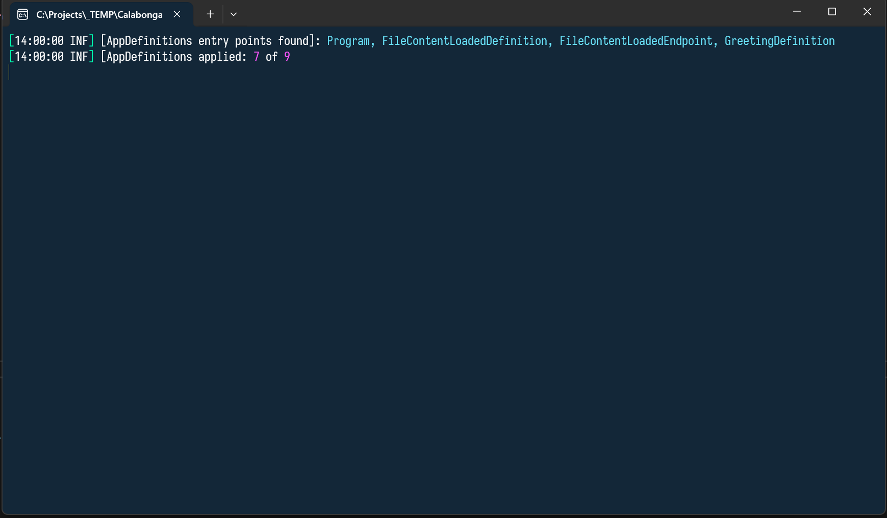

# Calabonga.AspNetCore.AppDefinitions

Сборка позволяет навести порядок в вашем `Program.cs`. Можно всё разложить "по полочкам". А еще можно реализовать систему плагинов. Чтобы воспользоваться сборкой надо просто установить nuget-пакет [Calabonga.AspNetCore.AppDefinitions](https://www.nuget.org/packages/Calabonga.AspNetCore.AppDefinitions/).

## Что нового

### Версия 2.4.2

* Для ConfgureApplication() и для ConfigureServices() теперь есть свой собственный индекс сортировки.
* Переработана информация при логировании в ILogger.
* Исправлены некоторые синтаксические ошибки, а также добавлены новые. :)

### Версия 2.4.1

* Nuget-пакеты обновлены для использования `NET8`
* Был добавлен перехват ошибок при поиске модулей определений (AppDefinition).

### Версия 2.4.0

На ряду с версией для NET6.0 добавлена версия для NET8.0. В параметры пакетов добавлены следующие настройки:

* Source Link
* Deterministic (dll/exe)
* Compiler flags

А также исправлены некоторые недочеты в процесс формирования и публикации nuget-пакета.

### Версия 2.3.0

Добавлена обработка дубликатов AppDefinitions, которые были найдены в сторонних сборках. Дополнительная информация о найденых дубликатах определений теперь выводиться в процессе отладке (DEBUG) включенном в настройках логирования.

Информация при уровне логирования  `LogLevel = "Debug"`:


Информация при уровне логирования  `LogLevel = "Information"`:




### Версия 2.2.0

Создан шаблон для генерации проекта `ASP.NET Web API c AppDefinitions`. То есть, чтобы не устанавливать каждый раз `Calabonga.AspNetCore.AppDefinitions` nuget-пакет в новый (в пустой) проект, можно воспользоваться уже готовым шаблоном, который создаст приложение с установленным nuget-пакетом (плюс еще *Serilog*). Это гораздо быстрее и удобнее. Я использую этот шаблона в своих видео на своём канале [boosty.to/calabonga](https://boosty.to/calabonga).

 [Проект шаблона с инструкцией по использованию](https://github.com/Calabonga/Calabonga.AspNetCore.AppDefinitions.Template). 

### Версия 2.1.0

* В новой версии появилась возможность подключения модулей к проекту. Достаточно воспользовать новым способом регистрации.
```
// Вместо этого (instead of)
builder.AddDefinitions(typeof(Program));

// использовать этот (use this to add definitions for application)
const string moduleFolder = "Modules:Folder";
var modulesPath = builder.Configuration[moduleFolder] ?? throw new ArgumentNullException(moduleFolder);
builder.AddDefinitionsWithModules(modulesPath, typeof(Program));
```
* Вывод зарегистрированных AppDefinitions усовершенствована.
```
[15:43:03 DBG] [AppDefinitions]: From Program
[15:43:03 DBG] [AppDefinitions]: AuthorizationDefinition (Program) (Enabled: Yes)
[15:43:03 DBG] [AppDefinitions]: AuthorizeEndpoints (Program) (Enabled: Yes)
[15:43:03 DBG] [AppDefinitions]: AutomapperDefinition (Program) (Enabled: Yes)
[15:43:03 DBG] [AppDefinitions]: CommonDefinition (Program) (Enabled: Yes)
[15:43:03 DBG] [AppDefinitions]: ContainerDefinition (Program) (Enabled: Yes)
[15:43:03 DBG] [AppDefinitions]: CorsDefinition (Program) (Enabled: Yes)
[15:43:03 DBG] [AppDefinitions]: DataSeedingDefinition (Program) (Enabled: Yes)
[15:43:03 DBG] [AppDefinitions]: DbContextDefinition (Program) (Enabled: Yes)
[15:43:03 DBG] [AppDefinitions]: ErrorHandlingDefinition (Program) (Enabled: Yes)
[15:43:03 DBG] [AppDefinitions]: ETagGeneratorDefinition (Program) (Enabled: Yes)
[15:43:03 DBG] [AppDefinitions]: EventItemEndpoints (Program) (Enabled: Yes)
[15:43:03 DBG] [AppDefinitions]: FluentValidationDefinition (Program) (Enabled: Yes)
[15:43:03 DBG] [AppDefinitions]: MediatorDefinition (Program) (Enabled: Yes)
[15:43:03 DBG] [AppDefinitions]: OpenIddictDefinition (Program) (Enabled: Yes)
[15:43:03 DBG] [AppDefinitions]: ProfilesEndpoints (Program) (Enabled: Yes)
[15:43:03 DBG] [AppDefinitions]: SwaggerDefinition (Program) (Enabled: Yes)
[15:43:03 DBG] [AppDefinitions]: TokenEndpoints (Program) (Enabled: Yes)
[15:43:03 DBG] [AppDefinitions]: UnitOfWorkDefinition (Program) (Enabled: Yes)
[15:43:03 DBG] From Program assemblies totally AppDefinitions found: 18
[15:43:04 DBG] Total AppDefinitions applied: 18
```
* Появилась возможность не только включать/выключать определенные AppDefinitions, но и указывать нужно ли их экспортировать или нет. Обратите внимание, что по умолчанию `Exported` свойство задано как `False`, то есть, не экспортировать данный `AppDefinition`. Например, если регистрацию конечной точки (endpoint) `WeatherForcast` слелать через определение (AppDefinition), то экспорт мог бы выглядеть так:
```
public class WeatherForecastEndpoints : AppDefinition
{
    /// <summary>
    /// Enables or disables export definition as a content for module that can be exported.
    /// </summary>
    /// /// <remarks>Default values is <c>False</c></remarks>
    public override bool Exported => true;

    public override void ConfigureApplication(WebApplication app)
    {
        app.MapGet("/weatherforecast", WeatherGet)
            .ProducesProblem(401)
            .Produces<WeatherForecast[]>()
            .WithName("GetWeatherForecast")
            .WithTags("ModuleTwo")
            .WithOpenApi()
            .RequireAuthorization(policyNames: CookieAuthenticationDefaults.AuthenticationScheme + ",OpenIddict.Validation.AspNetCore");
    }

    // [FeatureGroupName("Weather")]
    private WeatherForecast[] WeatherGet([FromServices] ILogger<WeatherForecastEndpoints> logger)
    {
        var summaries = new[] { "Freezing", "Bracing", "Chilly", "Cool", "Mild", "Warm", "Balmy", "Hot", "Sweltering", "Scorching" };
        var forecast = Enumerable.Range(1, 5).Select(index =>
                new WeatherForecast
                (
                    DateOnly.FromDateTime(DateTime.Now.AddDays(index)),
                    Random.Shared.Next(-20, 55),
                    summaries[Random.Shared.Next(summaries.Length)]
                ))
            .ToArray();
        logger.LogInformation("WeatherForecast request execute at [{Time}].", DateTime.UtcNow);
        return forecast;
    }
}
```

### Версия 2.0.0

* Больше не требуется вливать зависимость `IServiceCollection` в метод `ConfigureServices`. Теперь достаточно только `WebApplicationBuilder`. Следовательно при переходе на версию 2.0.0 нужно просто удалить лишние зависимости. Например, регистрация `FluentValidation` это выглядит так:
``` csharp
/// <summary>
/// FluentValidation registration as Application definition
/// </summary>
public class FluentValidationDefinition : AppDefinition
{
    /// <summary>
    /// Configure services for current application
    /// </summary>
    /// <param name="builder"></param>
    public override void ConfigureServices(WebApplicationBuilder builder)
    {
        builder.Services.Configure<ApiBehaviorOptions>(options =>
        {
            options.SuppressModelStateInvalidFilter = true;
        });

        builder.Services.AddValidatorsFromAssembly(typeof(Program).Assembly);
    }
}
```

* Регистрация стала гораздо проще.
``` csharp
builder.AddDefinitions(typeof(Program));
```

## Установка nuget-пакета

Можно воспользоваться инструментов Visual Studio:


Или можно просто прописать в файле проекта, но тогда надо будет подставить правильную версию пакета. Посмотреть последнюю актуальную версию можно на [nuget.org](https://www.nuget.org/packages/Calabonga.AspNetCore.AppDefinitions/).


### Создание AppDefinitions

Создайте папку `Definitions` в вашем проекте. В папке создайте `ContainerDefinition` и унаследуйте его от `AppDefinition`, как показано ниже на картинке. После этого сделайте переопределение метода `ConfigureServices` и/или других методов и свойств.


На этой картинке переопределено два метода:


Подключите ваши определения как показано на этой картинке:


Таких определений (наследников от `AppDefinition`) может быть сколько угодно (конечно же в разумных пределах). После старта приложения вы увидите (если включен уровень логирования `Debug`) список всех подключенных определений (`AppDefinition`). Например, в моём случае их 18.


### Фильтрация и порядок

У каждого из созданных вами наследников от `AppDefinition` есть свойство `Enabled` и `OrderIndex`. Угадайте, что можно с ними (с `AppDefinition`ами) сделать?

# An English
Application Definitions base classes. The small but very helpful package that can help you to organize your ASP.NET Core application.

You can find more information in my blog [Nimble Framework](https://www.calabonga.net/blog/post/nimble-framework-v-6-1)
